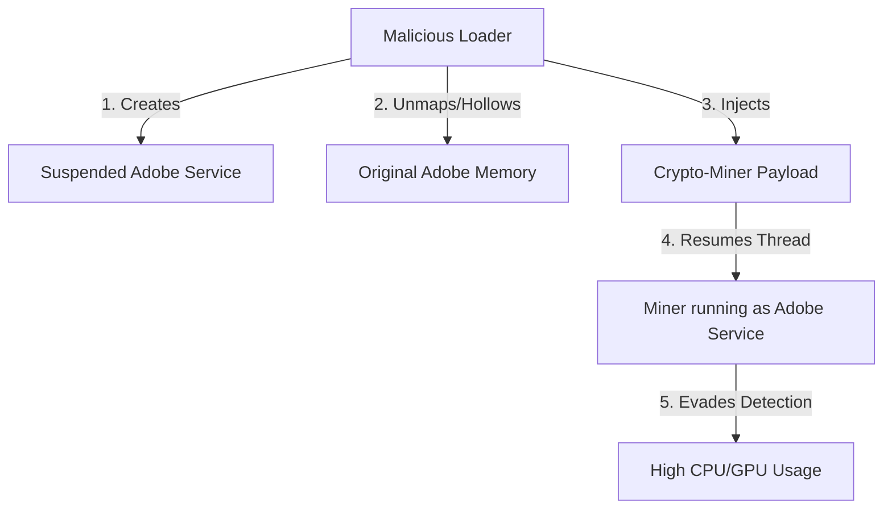
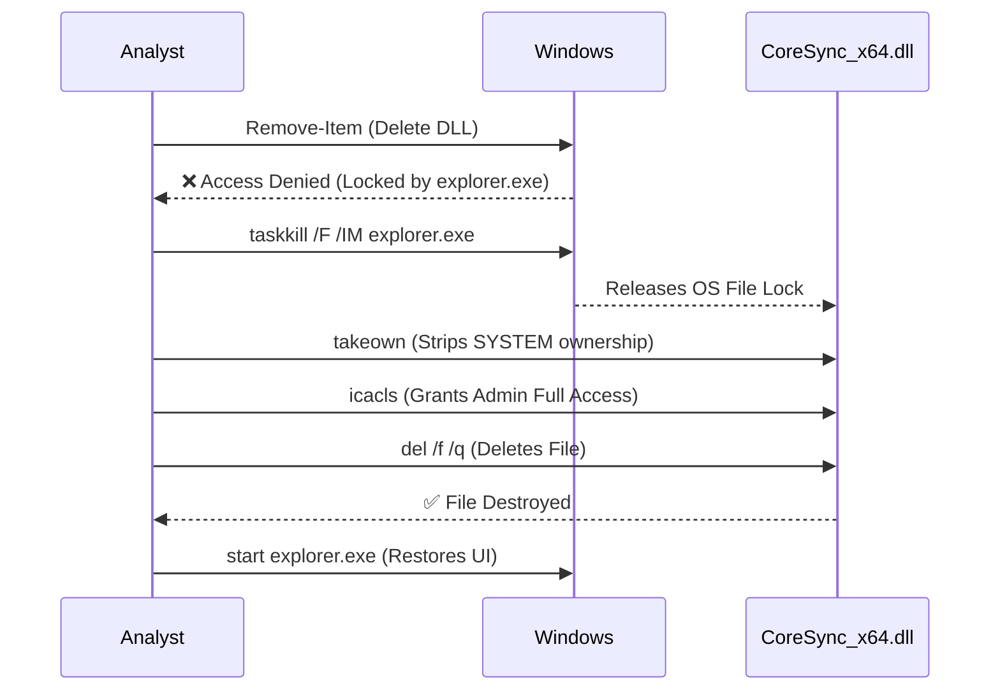
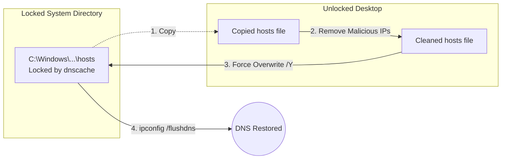

# Digital Forensics and Incident Response (DFIR) Post-Mortem: Eradicating a Stealthy Windows Crypto-Miner

**Author:** VAPT Analyst 
**Engagement Type:** Live Incident Response & Malware Eradication
**Target OS:** Windows 11

## 1. Executive Summary
During a routine security assessment of a system exhibiting unusually high latency and sluggish performance, we identified a highly evasive crypto-miner. The malware utilized process hollowing to disguise itself as legitimate Adobe components and established deep persistence using locked Shell Extensions and DNS hijacking. 

This report details the exact obstacles we faced during the manual eradication process, why standard administrative commands failed, and the advanced bypass techniques we utilized to reclaim the system.

---

## 2. The Threat Landscape & Initial Observations
The primary symptom was severe system lag. 
When attempting to investigate via Task Manager, the CPU/GPU spikes would immediately drop—a classic evasion technique used by modern miners that actively monitor for security tooling (`taskmgr.exe`, `processhacker.exe`).

Using alternative process enumeration methods (PowerShell `Get-Process`), we discovered malicious threads hiding inside legitimate Adobe background services. This technique is known as **Process Hollowing** (launching a legitimate process in a suspended state and injecting malicious code into its memory space).



---

## 3. Obstacle 1: The "Unkillable" Shell Extension (Persistence)

To ensure the miner survived reboots, it dropped a malicious payload named `CoreSync_x64.dll` and registered it as a Windows Shell Extension.

### ❌ What We Tried That Failed:
We attempted to delete the malicious DLL using a standard administrative PowerShell command:
```powershell
Remove-Item -Path "C:\MaliciousPath\CoreSync_x64.dll" -Force
```
**Why it failed:** 
We received an `Access Denied` and `File in Use` error. Because the malware registered itself as a Shell Extension, the DLL was injected directly into `explorer.exe` (the Windows UI shell). As long as `explorer.exe` was running, the file was locked by the operating system. Furthermore, the file permissions were strictly locked to the `SYSTEM` account.

### ✅ How We Bypassed It:
To eradicate the DLL, we had to strip its file permissions and break the operating system lock simultaneously. 

**Step 1: Kill the Shell**
We dropped the entire Windows user interface to break the file lock:
```cmd
taskkill /F /IM explorer.exe
```

**Step 2: Strip SYSTEM Ownership**
While the shell was dead (leaving us with just a command prompt), we seized ownership of the file from the SYSTEM account:
```cmd
takeown /f "C:\MaliciousPath\CoreSync_x64.dll"
```

**Step 3: Grant Administrator Access**
We rewrote the Access Control List (ACL) to give local administrators full read/write/delete privileges:
```cmd
icacls "C:\MaliciousPath\CoreSync_x64.dll" /grant administrators:F
```

**Step 4: Eradication and Restoration**
With the locks broken and permissions secured, the standard delete command finally worked:
```cmd
del /f /q "C:\MaliciousPath\CoreSync_x64.dll"
start explorer.exe
```



---

## 4. Obstacle 2: DNS Hijacking via the Hosts File

The malware hijacked `C:\Windows\System32\drivers\etc\hosts` to block connections to antivirus update servers and security telemetry endpoints by routing their domains to `127.0.0.1`.

### ❌ What We Tried That Failed:
We tried to open the `hosts` file in Notepad as Administrator, delete the malicious entries, and save it. We also tried using PowerShell to clear the file:
```powershell
Clear-Content "C:\Windows\System32\drivers\etc\hosts"
```
**Why it failed:**
Windows blocked the save/modification. The `dnscache` service (DNS Client) maintains a strict, exclusive lock on the `hosts` file in modern Windows builds to prevent exactly this kind of tampering. You cannot easily stop `dnscache` from the services menu, as it is a protected system service.

### ✅ How We Bypassed It:
We used a "File Swapping" technique to bypass the active memory lock.

**Step 1: Copy to an Unlocked Location**
We copied the locked file to the user's Desktop, which severs the link to the `dnscache` service for the copied version:
```powershell
Copy-Item "C:\Windows\System32\drivers\etc\hosts" "$env:USERPROFILE\Desktop\hosts"
```

**Step 2: Clean the File Safely**
We opened the unlocked Desktop copy in a text editor, deleted all the malicious `127.0.0.1` sinkhole domains, and saved it.

**Step 3: Forceful Overwrite**
We then forcefully overwrote the original file in the System32 directory using the command line, which Windows allows during a copy operation despite the file handle lock:
```cmd
copy /Y "%USERPROFILE%\Desktop\hosts" "C:\Windows\System32\drivers\etc\hosts"
ipconfig /flushdns
```
By flushing the DNS, we cleared the poisoned domains from live memory, fully restoring the machine's ability to communicate with security servers.



---

## 5. Obstacle 3: Syntax Collisions in Command Execution

While cleaning up the malware's dropped temporary directories, we encountered a mechanical tooling issue.

### ❌ What We Tried That Failed:
We attempted to remove the malicious directories using standard DOS commands directly inside a PowerShell terminal:
```powershell
rd /s /q "C:\Malicious\Temp\Dir"
```
**Why it failed:**
In PowerShell, `rd` is not the DOS "remove directory" command; it is an alias for the `Remove-Item` cmdlet. The flags `/s` and `/q` are DOS-specific and caused PowerShell to throw a parameter binding syntax error.

### ✅ How We Bypassed It:
We recognized the environment mismatch and wrapped the DOS command in a `cmd.exe` sub-process, explicitly forcing it to execute in a native DOS context rather than PowerShell:
```powershell
cmd.exe /c "rd /s /q C:\Malicious\Temp\Dir"
```
Alternatively, we later utilized the native PowerShell equivalent for cleaner automation:
```powershell
Remove-Item -Path "C:\Malicious\Temp\Dir" -Recurse -Force
```

---

## 6. Conclusion & Automation

By systematically hunting down the injected processes, breaking the OS-level file locks on the Shell Extensions, and bypassing the DNS cache lock on the hosts file, the crypto-miner was completely eradicated. System latency dropped immediately, and performance was restored to nominal levels.

To prevent future manual labor, the lessons learned and commands utilized during this engagement were codified into two custom Python DFIR scripts: **ThreatHunter.py** (User-Mode analysis) and **KernelRootkitScanner.py** (Ring-0 analysis). These tools automate the exact checks performed during this engagement, allowing for instantaneous future audits.

---

## 7. Open Source DFIR Tooling

To help other security researchers and VAPT analysts, I have open-sourced the automated Python tools we built during this engagement. 

You can find **ThreatHunter.py**, **KernelRootkitScanner.py**, and the complete wrapper scripts on my GitHub:

🔗 **[GitHub Repository: Windows-DFIR-Audit-Suite](https://github.com/sxyjvs10/Windows-DFIR-Audit-Suite)**

*Feel free to fork it, contribute, or use it on your next hunt!*
